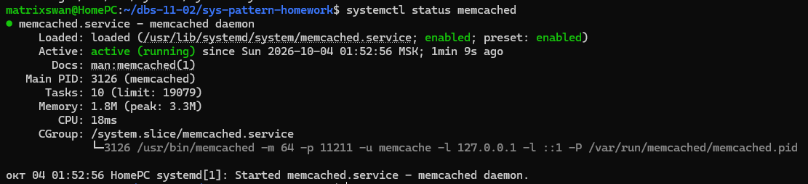
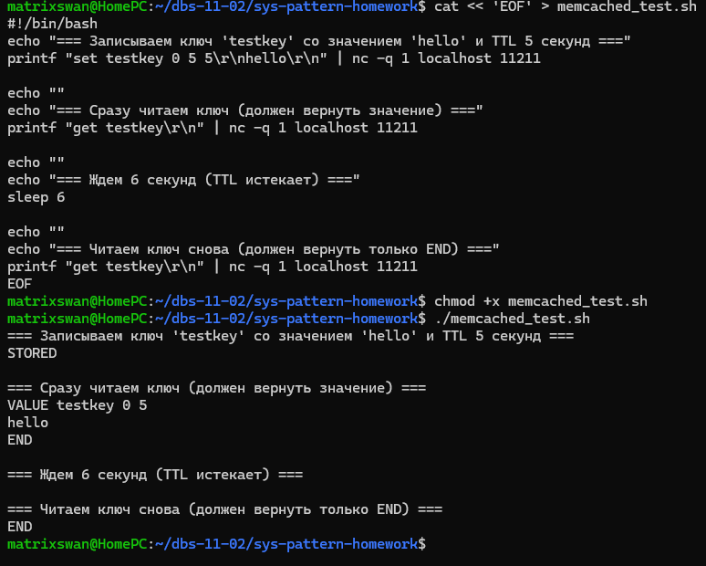
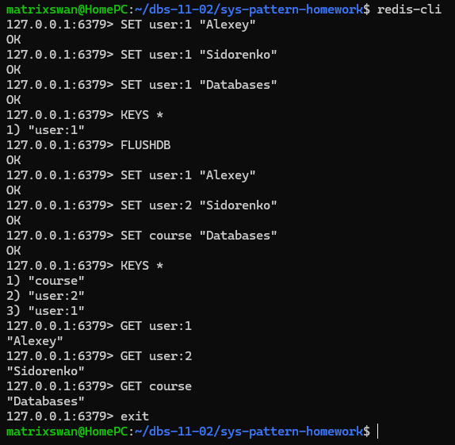

# Домашнее задание к занятию "`Кеширование Redis/memcached`" - `Сидоренко Алексей`

---

### Задание 1 Кэширование

Приведите примеры проблем, которые может решить кеширование.
Приведите ответ в свободной форме.

### Ответ

Кеширование решает следующие основные проблемы:
1. Снижение нагрузки на базу данных (БД): При частых запросах на чтение (например, просмотр популярных товаров или новостей) данные отдаются из кэша, что предотвращает перегрузку и блокировки в основной БД.
2. Ускорение отклика приложения (снижение задержки): Чтение данных из оперативной памяти (RAM) происходит на порядки быстрее, чем чтение с диска или выполнение сложных SQL-запросов. Это критично для пользовательского опыта (UX).
3. Обработка пиковых нагрузок (Highload): При внезапном всплеске трафика (например, старт продаж билетов или хайповая публикация) кэш берет на себя основную нагрузку, защищая бэкенд и БД от падения (эффект "Slashdot effect").
4. Хранение сессий пользователей: В распределенных системах (кластерах) кэш позволяет хранить сессии пользователей в едином быстром хранилище, чтобы любой сервер приложения мог быстро получить данные сессии без обращения к БД.
5. Снижение затрат на инфраструктуру: Вместо дорогого масштабирования (scaling up) серверов базы данных, можно вынести частые запросы в относительно дешевые серверы кэширования.

---

### Задание 2. Memcached

Установите и запустите memcached. Приведите скриншот `systemctl status memcached`, где будет видно, что memcached запущен.

**Этапы выполнения:**
1. Установка: `sudo apt update && sudo apt install memcached`
2. Запуск и добавление в автозагрузку: `sudo systemctl start memcached && sudo systemctl enable memcached`
3. Проверка статуса: `systemctl status memcached`

**Скриншот:**


---

### Задание 3. Удаление по TTL в Memcached

Запишите в memcached несколько ключей с любыми именами и значениями, для которых выставлен TTL 5. Приведите скриншот, на котором видно, что спустя 5 секунд ключи удалились из базы.

**Этапы выполнения:**

1. Создание bash-скрипта для автоматической проверки TTL:
   ```bash
   cat << 'EOF' > memcached_test.sh
   #!/bin/bash
   echo "=== Записываем ключ 'testkey' со значением 'hello' и TTL 5 секунд ==="
   printf "set testkey 0 5 5\r\nhello\r\n" | nc -q 1 localhost 11211

   echo ""
   echo "=== Сразу читаем ключ (должен вернуть значение) ==="
   printf "get testkey\r\n" | nc -q 1 localhost 11211

   echo ""
   echo "=== Ждем 6 секунд (TTL истекает) ==="
   sleep 6

   echo ""
   echo "=== Читаем ключ снова (должен вернуть только END) ==="
   printf "get testkey\r\n" | nc -q 1 localhost 11211
   EOF

   chmod +x memcached_test.sh
   ./memcached_test.sh
```
Наблюдаем результат:
Сразу после записи ключ testkey существует и возвращает значение hello.
После ожидания 6 секунд (TTL = 5 секунд истёк) ключ автоматически удаляется, и команда get возвращает только END.



---

### Задание 4. Запись данных в Redis

Запишите в Redis несколько ключей с любыми именами и значениями. Через `redis-cli` достаньте все записанные ключи и значения из базы, приведите скриншот этой операции.

**Этапы выполнения:**

1. Установка клиента и сервера Redis:
   ```bash
   sudo apt install redis-server redis-tools -y
   sudo systemctl start redis-server
   sudo systemctl enable redis-server
   redis-cli ping
   redis-cli
   SET user:1 "Alexey"
   SET user:2 "Sidorenko"
   SET course "Databases" #Запись нескольких ключей с разными именами и значениями
   KEYS * #Получение списка всех ключей в базе
   exit #Выход из консоли```

